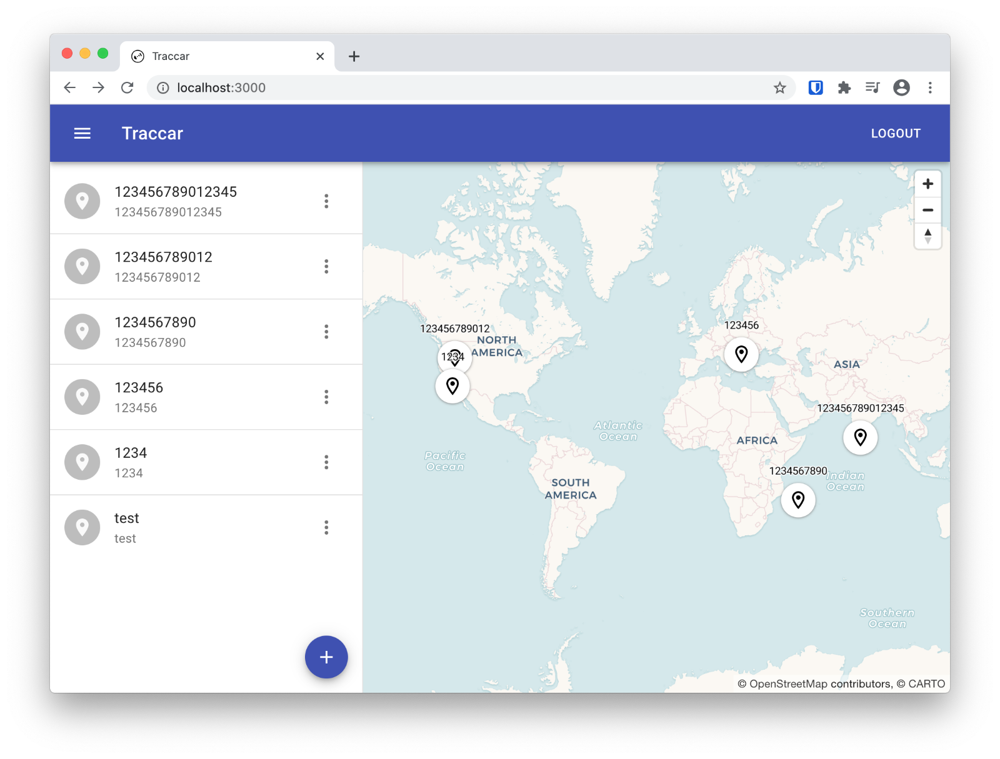

<!--
Este archivo README esta generado automaticamente<https://github.com/YunoHost/apps/tree/master/tools/readme_generator>
No se debe editar a mano.
-->

# Traccar para Yunohost

[](https://dash.yunohost.org/appci/app/traccar)  

[](https://install-app.yunohost.org/?app=traccar)

*[Leer este README en otros idiomas.](./ALL_README.md)*

> *Este paquete le permite instalarTraccar rapidamente y simplement en un servidor YunoHost.*  
> *Si no tiene YunoHost, visita [the guide](https://yunohost.org/install) para aprender como instalarla.*

## Descripción general

Traccar is an open source GPS tracking system. It supports more than 200 GPS protocols and more than 2000 models of GPS tracking devices.

### Features

- Real-time GPS tracking
- Driver behaviour monitoring
- Detailed and summary reports
- Geofencing functionality
- Alarms and notifications
- Account and device management
- Email and SMS support


**Versión actual:** 6.2~ynh1

**Demo:** <https://www.traccar.org/demo-server/>

## Capturas



## Documentaciones y recursos

- Sitio web oficial: <https://www.traccar.org/>
- Documentación administrador oficial: <https://www.traccar.org/documentation/>
- Repositorio del código fuente oficial de la aplicación : <https://github.com/traccar/traccar>
- Catálogo YunoHost: <https://apps.yunohost.org/app/traccar>
- Reportar un error: <https://github.com/YunoHost-Apps/traccar_ynh/issues>

## Información para desarrolladores

Por favor enviar sus correcciones a la [`branch testing`](https://github.com/YunoHost-Apps/traccar_ynh/tree/testing

Para probar la rama `testing`, sigue asÍ:

```bash
sudo yunohost app install https://github.com/YunoHost-Apps/traccar_ynh/tree/testing --debug
o
sudo yunohost app upgrade traccar -u https://github.com/YunoHost-Apps/traccar_ynh/tree/testing --debug
```

**Mas informaciones sobre el empaquetado de aplicaciones:** <https://yunohost.org/packaging_apps>
